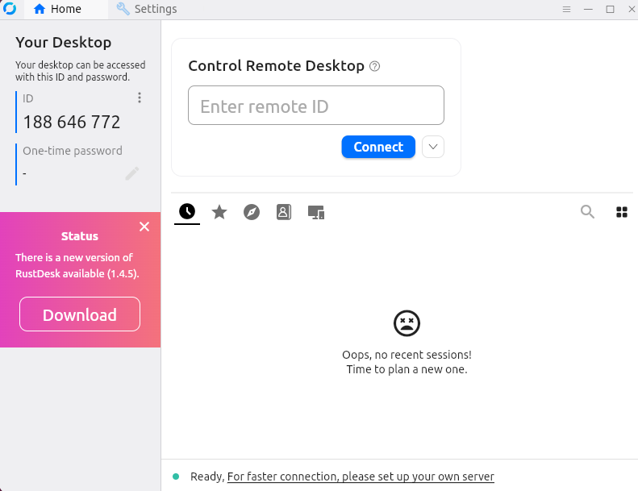
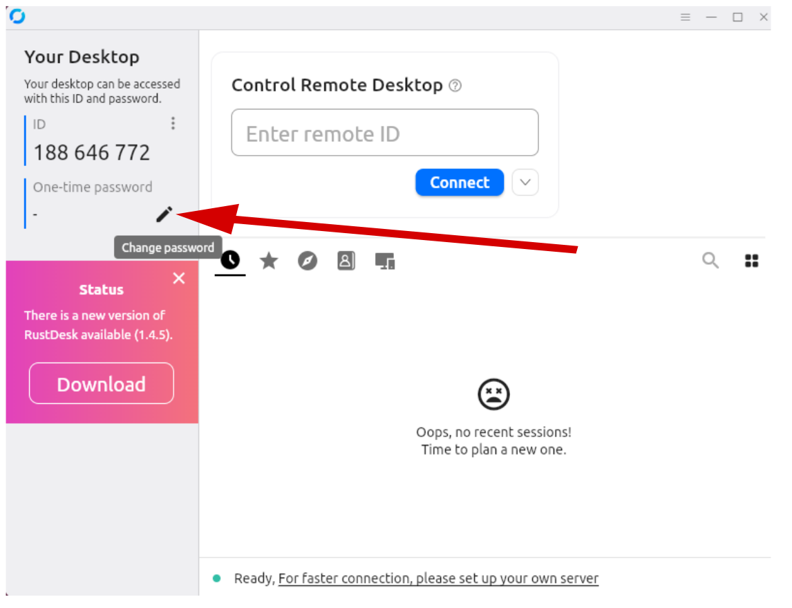
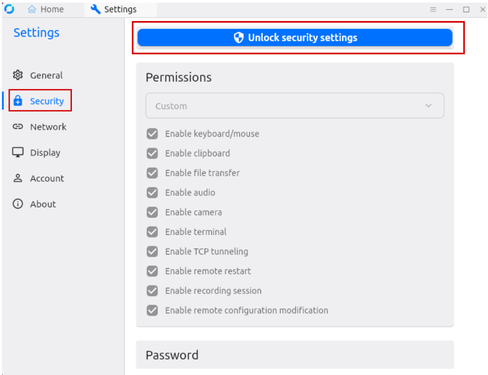
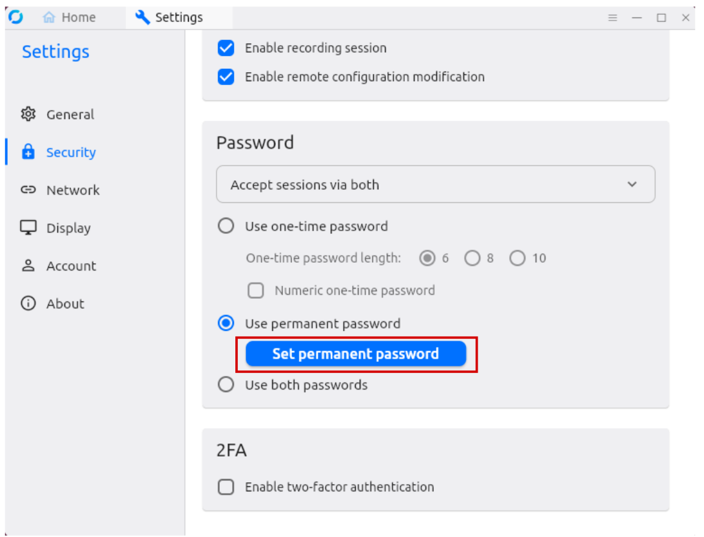
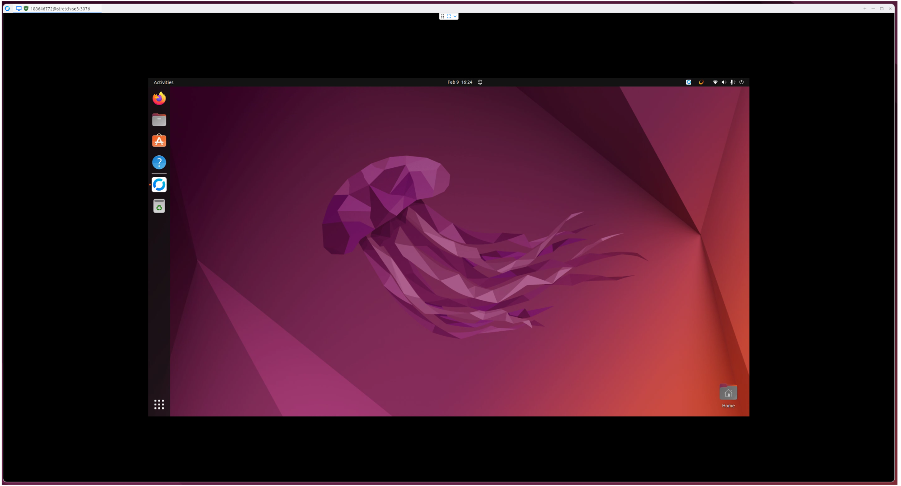

# RustDesk Setup

## Requirements

You will need a **dummy HDMI dongle** if you want to use the Stretch robot with a remote desktop without a physical monitor connected.

**Note: You do not need the HDMI dongle during the `RustDesk` installation.
For installation, you must first connect the robot to your host computer using a regular HDMI cable. The dummy HDMI dongle is only required after `RustDesk` has been installed.**

## Install RustDesk

1. [Download RustDesk](https://github.com/rustdesk/rustdesk/releases/tag/1.4.4) on both your host machine and the robot. 

    1. For your host machine, downloads are available for Windows, macOS, and Ubuntu.

    2. For the robot, download the `x86-64 (64-bit)` Ubuntu version. Once downloaded, install it with:

    ```bash
    cd ~/Downloads/
    sudo apt install ./rustdesk-1.4.4-x86_64.deb
    ```
2. Make sure an HDMI cable is connected between your host computer and the robot.
**Open `RustDesk` on the robot**, either from the applications menu or by running:

    ```bash
    rustdesk
    ```

<div align="center">
  
</div>

3. Note the `ID` shown in `RustDesk`—you will need it later.

4. Set a `Permanent password`:

   1. Click the edit icon:

      <div align="center">
        
      </div>

   2. Click `Security` on the left-hand side, then select `Unlock security settings`:

      <div align="center">
        
      </div>

   3. Click `Set permanent password` and set your password:

      <div align="center">
        
      </div>

5. Close `RustDesk` on the robot.
Disconnect the HDMI cable, connect the dummy HDMI dongle to the robot, and open `RustDesk` on your host machine.
    Enter the robot’s `ID` and permanent password.

    That’s it—you now have a remote connection to the robot using `RustDesk`:

      <div align="center">
        
      </div>

